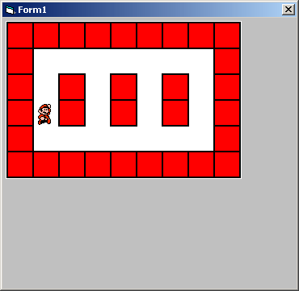



## SIMPLE PIXEL COLLISION DETECTION

### Description

Very simple pixel collision detection. This code can be used as a starting point for a map-type game for beginners in visual basic
 
### More Info
 

             |
---                |---
**Submitted On**   |2005-05-21 04:27:40
**By**             |[Foundations Software](https://github.com/Planet-Source-Code/PSCIndex/blob/master/ByAuthor/foundations-software.md)
**Level**          |Beginner
**User Rating**    |5.0 (10 globes from 2 users)
**Compatibility**  |VB 6\.0
**Category**       |[Graphics](https://github.com/Planet-Source-Code/PSCIndex/blob/master/ByCategory/graphics__1-46.md)
**World**          |[Visual Basic](https://github.com/Planet-Source-Code/PSCIndex/blob/master/ByWorld/visual-basic.md)
**Archive File**   |[SIMPLE\_PIX1890315212005\.ZIP](https://github.com/Planet-Source-Code/foundations-software-simple-pixel-collision-detection__1-60613/archive/master.zip)

